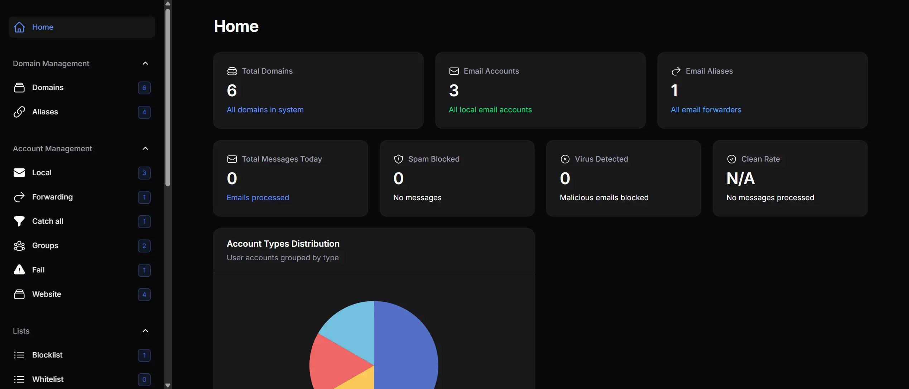
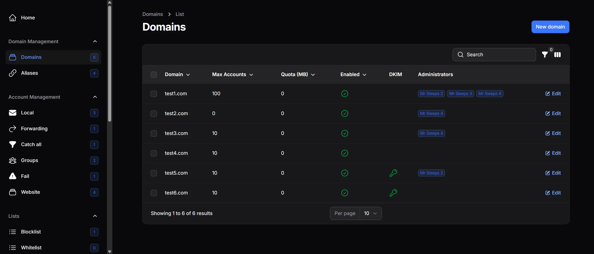
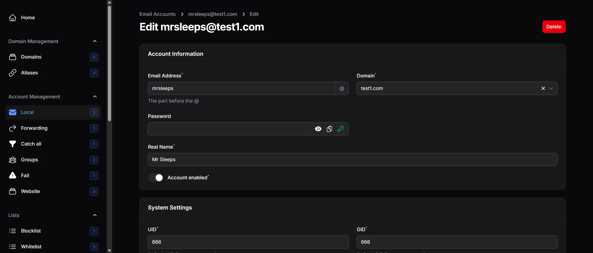

# VExim Web UI
This web app with a catchy name is to manage your [VExim2](https://github.com/vexim/vexim2 "VEXIM2") install.

It's a (very) cut down version of the UI I use to manage our mailservers (with the business logic removed) and some of the changes to the original VExim2 configs we have made over the years.

**Please note we have modified the original VExim2 database files, this will not work with the stock VExim2 (and our install script will modify the stock VExim2 install) - we do however provide migrations ;)**

### Features

- Modern responsive UI with light and dark modes
- Separate web and email accounts
- Manage accounts, domains, emails, forwarders, fails, whitelist, blacklist
- 2FA and Passkeys login
- CLI commands
- RSpamd support (because **I hate SpamAssassin**)
- DKIM support (Can also update your DNS automatically if you use PowerDNS)
- Autodiscover support

### Requirements
- PHP 8.4+
- Mariadb/Mysql
- Shell access

### Everyone loves a screenshot
#### The dashboard

#### Email domains

#### Edit account



### Things to know before diving in
This is a complete rewrite of the original VEXIM2 php code and does require changes to your main VExim2 database tables (it doesn't overly affect the Exim configs, kept those to a minumum, it's just for the web ui but for various reason they share the same database (mainly because cross-db eloquent relationships in Laravel are an ugly nightmare and not many people have SQL replication setup)). **Back up your VExim database before attempting to install this!** (Check the database/migrations folder) if you want to know what has changed.

It no longer supports the "siteadmin" login, you will need to create a new system admin user account (does it for you during the install).

Nor does it support pipe commands, they're a security nightmare and because of that there is no support for them in this ui (you can still add them manually if you want to open up your server for all kinds of potential trouble - Have a read of [at this comment](https://github.com/vexim/vexim2/pull/300#issuecomment-4692028967) for a tiny insight as to why).

I have also only tested this on Debian Bookworm and Trixie..

### How to install
Firstly, **backup your VExim database**.

Create a new veximweb system user account:

`sudo adduser veximweb`

You'll need to install php if you haven't already:

`sudo apt install -y php8.5 php8.5-bcmath php8.5-cli php8.5-curl php8.5-fpm php8.5-gd php8.5-imap php8.5-intl php8.5-ldap php8.5-mailparse php8.5-mbstring php8.5-mysql php8.5-soap php8.5-xml php8.5-zip`

If that fails, install the [Sury php repo](https://deb.sury.org/ "sury php repo") and try again.

Now copy the docs/fpm/vexim.conf file to /etc/php/8.5/fpm/pool.d/

If you kept the newly created user account as veximweb you won't need to change anything, if you didn't then you'll need to edit that file.

Now restart php8.5-fpm:

`service php8.5-fpm restart`

Now you need to point your web server to the directory, how you do that is up to you but make sure it uses the php-fpm worker we just installed. An example NGINX config is supplied in docs/nginx.

I have made changes to the VExim exim config files, again look under docs/exim and install those if they differ from yours (the sql has been modernised, doesn't make a huge change). You will need, at the very least, to install my version of debian-conf.d/main/00_vexim_listmacrosdefs, there are a fair few changes in that (DKIM, RSpamd/SpamAssassin).

If you are using SpamAssassin, you will need to edit debian-conf.d/main/00_vexim_listmacrosdefs and change the stuff right at the bottom

```
# Choose spam scanner - uncomment only ONE of these:
SPAM_ENGINE_RSPAMD = yes
# SPAM_ENGINE_SPAMASSASSIN = yes
```

*Just note, the whitelist config file will break your Exim if you don't delete the default exim whitelist config*.

I realise the Exim config installation explanation is a bit thin on details but I figured you have all installed VExim2, you should know what you are doing!

**Using RSpamd?**
VExin Web UI supports checking whitelists/blacklists in RSpamd via an API call, this is explained in more detail at the end of this readme.

## How to install the web ui

Onto installing the web ui. SU (or login) to your newly created user and run

`git clone https://github.com/MrSleeps/VExim-Web-UI.git`

Rename the directory

`mv VExim-Web-UI vexim_web`

Now cd into the directory
`cd vexim_web/`

Copy the example .env file

`cp .env.example .env`

Now fire up your favourite editor and edit the .env file

`nano .env`

You will need to update the following:

* APP_URL
* DB_CONNECTION
* DB_HOST
* DB_PORT
* DB_DATABASE
* DB_USERNAME
* DB_PASSWORD
* MAIL_HOST
* MAIL_PORT
* MAIL_USERNAME
* MAIL_PASSWORD
* MAIL_FROM_ADDRESS
* MAIL_FROM_SUPPORT_ADDRESS
* MAIL_FROM_SUPPORT_NAME
* VEXIM_GID
* VEXIM_UID
* VEXIM_SYSADMIN_SET_GUID (not currently enabled but that's coming very soon)
* VEXIM_MAILMAN_ENABLED
* VEXIM_ENFORCE_2FA
* VEXIM_SPAM_ENGINE
* HEALTH_TO_ADDRESS (System does basic health checks, this is where you get the report emailed to)

Pretty self explanatory, just note that the database user needs to have write access to the VExim database, you can make a new sql user by running the commands below:

Create the user:
`CREATE USER 'newuser'@localhost IDENTIFIED BY 'strongpassword';`

Grant permissions to the database (replace database_name to the one you are using for  vexim):
`GRANT ALL PRIVILEGES ON database_name.* TO 'newuser'@localhost WITH GRANT OPTION;`

Apply changes:
`FLUSH PRIVILEGES;`

Now on to the fun stuff.

**MAKE SURE YOU HAVE BACKED UP YOUR CURRENT VEXIM DATABASE**

In the vexim_web directory run

`./setup-web.sh`

This should take you through the install process (it will fail miserably if you haven't updated the env file correctly) and create you a new user.

If you are starting with a blank canvas (ie no VExim install) it will install the VExim tables for you (if you say yes when it asks you that). It will prompt you to create a new user account, be careful, that account has full access to all domains, emails etc.

**If this is not a fresh install, you will need to add the dkim database table, the schema for that is located in the docs/dkim folder.**

If that finishes without any errors you can now login via your newly created account. Visit https://yourveximwebsite.com and login..

Things I recommend you do on a new install:
Check the settings page, this is where your system settings are (GID, UID etc). Make sure they are correct (it does pick them up from the env variables).
Have a look at the email templates under the "Communications" heading, these are what get sent out to users.

## CLI commands
I have included a basic set of CLI commands that you can use. You can do basic control of users, emailaccounts and domains (including aliases) using them.

#### Web accounts:
`php artisan vw:users`

  **Add a new user:**

    php artisan vw:users add

  **Delete a user:**

    php artisan vw:users delete 1
    php artisan vw:users delete john@example.com

  **Search users:**

    php artisan vw:users search john
    php artisan vw:users search "john doe"
    php artisan vw:users search john --role=system_admin
    php artisan vw:users search john --status=active

  **List all users:**

    php artisan vw:users list
    php artisan vw:users list --role=system_admin
    php artisan vw:users list --status=active

  **Show user details:**

    php artisan vw:users show 1
    php artisan vw:users show john@example.com

  **Activate a user:**

    php artisan vw:users activate 1
    php artisan vw:users activate john@example.com

  **Deactivate a user:**

    php artisan vw:users deactivate 1
    php artisan vw:users deactivate john@example.com

#### Email accounts
`php artisan vw:email`

  **Add a new email user:**

    php artisan vw:email add

  **Delete an email user:**

    php artisan vw:email delete user@example.com
    php artisan vw:email delete 1

  **Search email users:**

    php artisan vw:email search user@example.com
    php artisan vw:email search user --domain=example.com

  **List email users:**

    php artisan vw:email list
    php artisan vw:email list --domain=example.com
    php artisan vw:email list --type=local
    php artisan vw:email list --status=enabled

  **Show email user details:**

    php artisan vw:email show user@example.com
    php artisan vw:email show 1

  **Enable an email user:**

    php artisan vw:email enable user@example.com

  **Disable an email user:**

    php artisan vw:email disable user@example.com

#### Domain management
`php artisan vw:domains`

  **Add a new domain:**

    php artisan vw:domains add

  **Delete a domain:**

    php artisan vw:domains delete 1
    php artisan vw:domains delete example.com

  **Search domains:**

    php artisan vw:domains search example
    php artisan vw:domains search example --type=local
    php artisan vw:domains search example --status=enabled

  **List all domains:**

    php artisan vw:domains list
    php artisan vw:domains list --type=local
    php artisan vw:domains list --status=enabled

  **Show domain details:**

    php artisan vw:domains show 1
    php artisan vw:domains show example.com

  **Activate a domain:**

    php artisan vw:domains activate 1
    php artisan vw:domains activate example.com

 **Deactivate a domain:**

    php artisan vw:domains deactivate 1
    php artisan vw:domains deactivate example.com

 ** Assign a user to a domain:**

    php artisan vw:domains assign 1 --user=5 --role=domain_admin
    php artisan vw:domains assign example.com --user=john@example.com --role=viewer

  **Unassign a user from a domain:**

    php artisan vw:domains unassign 1 --user=5
    php artisan vw:domains unassign example.com --user=john@example.com

## RSpamd
As mentioned earlier, RSpamd is supported (currently for whitelists and blacklists). It does this by calling an API route.

To get it working, have a look in the docs/rspamd folder and copy the files into their respective folders.

You will need to edit vexim.conf, add your host (https://your.vexim.domain) and you need an api key, you get that by going back into your vexim_web folder and running

`php artisan vw:create-rspamd-token user_id`

You can get the user_id of your account by running

`php artisan vw:users list --role=system_admin`

This gives you an X-API-Key (will look somethinglike: 1|ATA1MiQB5s0YpiP29msV7NxFxqABC5vc2cpBEmMfZVK4Q4Ho). Copy the **whole** of that and paste it into the api_key section of the rspamd vexim.conf file (you will need to wrap it in quotes).

Restart rspamd and watch your log files!

## Other things it does

### autodiscover
Ever used Thunderbird and it's autofound your mailservers settings? Probably autodiscover.

It's basically an XML file with the settings for your email account (IMAP, SMTP addresses). To get this working with the web ui, you need to setup a website called autodiscover.your-email.domain. Use our nginx config as an example.

Then, add a cname or a record of autodiscover.your-email.com pointing to the server where you have just setup the autodiscover website.

Thats pretty much it. Thunderbird always works, Outlook is (unsurprisingly) hit or miss.

Issues? [Post a new one on the git repository](https://github.com/MrSleeps/VExim-Web-UI/issues "Post a new one on the git repository").
